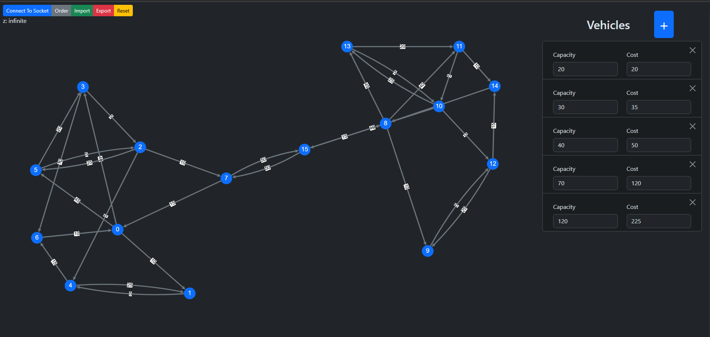

# FSMVRPTW Visual

This project is a visual representation of the **FSMVRPTW** (Fleet Size and Mix Vehicle Routing Problem with Time Windows) problem.  
Together with my collaborator, we developed a [Rust server](https://github.com/Simone-Lauro-itis-pr/fsmvrptw-server-noauth) that computes the solution to the problem, while this frontend — built using **React** — is used to display the solution graphically.

It was our first time using **React** and **Bootstrap**, so the code may not be the most efficient or easy to follow, but it was a valuable learning experience.

## 🔧 Technologies Used

- [React](https://react.dev/) – JavaScript library for building user interfaces
- [Bootstrap](https://getbootstrap.com/) – Styling and layout framework
- [Cytoscape.js](https://js.cytoscape.org/) – Library for graph theory visualization and analysis
- [Vite](https://vitejs.dev/) – Frontend build tool for fast development

## 🚀 How to Run

1. Clone this repository  
2. Clone [Rust server](https://github.com/Simone-Lauro-itis-pr/fsmvrptw-server-noauth)
3. run Rust server with the command `cargo run -r `
4. Install dependencies on this project:
    ```bash
    npm install react react-dom
    npm install bootstrap
    npm install cytoscape cytoscape-cxtmenu cytoscape-cose-bilkent cytoscape-spread cytoscape-cola
    npm install react-use-websocket
5. Start the development server with `npm run dev`

Make sure the Rust backend is running on the configured address before starting the frontend.


## How To Use
This project not only is used to represent the FSMVRPTW but is even usable as a graph editor.
It is possible to create a graph editing it and import or export one

This is the base interface
- `Connect To Socket`: to start the connection to the socket when you are done to editing the graph
- `Order`: it position the graph in a random position but makes the ARCs easier to see
- `Import`: import a JSON to render the graph
- `Export`: export a graph as a JSON
- `Reset`: refresh the page
- `+`: add a vehicle 


### Funtionality
- You can create a Node by pressing right click
- You can create an Arc by pressing sequentialy 2 differt Node, the click order will define the direction of the Node
- Holding right click on a Node or a Arc and slightly move the mouse, it will open a mini menu on the target.  
By pointing to the X direction you can remove the target.       
By pointing the cursor to the Edit voice a modal with the attribute of the Node will open and you will be able to edit it's parameters
- Holding left click on aNode will let give you the possibility to move the Node for better visibility

### Start the connection
This is the visibility of the node whenever you get a result from the WebService  
graph of example📄: [ src/examples/graph.json](src/examples/graph.json)
Initial Graph
  
Connected Graph  
  
Step of example
  
Solution
  
